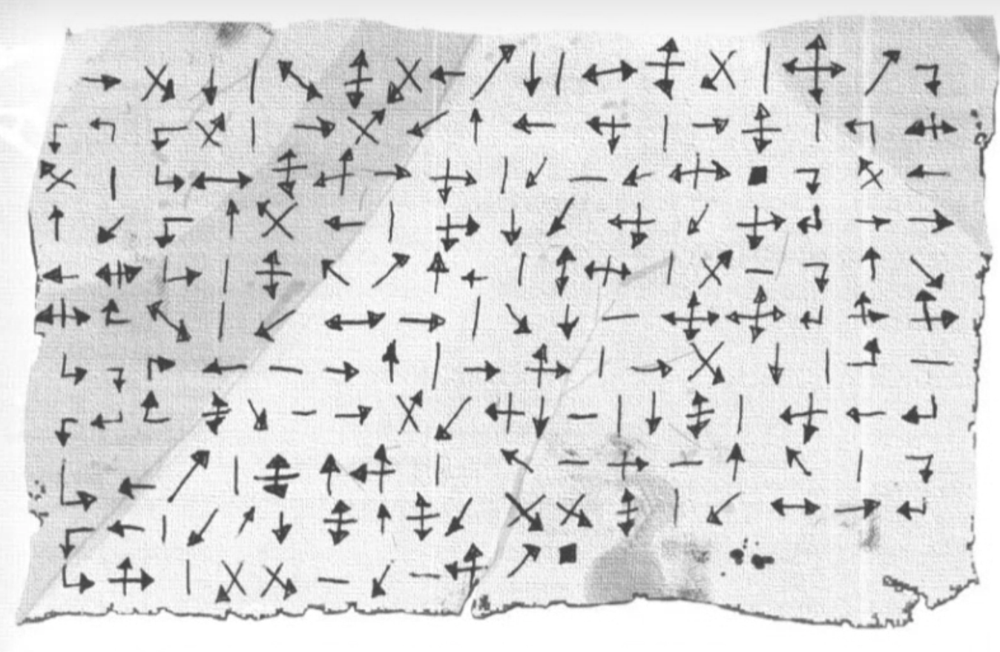

# Notes

## Session 7 - 4/17/20

* We're ditching this storyline
* Later, fools
* Seeya suckers
* Later alligators
* I'm sayin... bye-on... lions...
* ... or something

## Session 6 - 4/14/20

* Big reward for decoding the scroll
	* +1 Void for Shigatoki and Ryosei
	* Holy balls
* Misago's crew is "The Last Chance Bandits"
	* They're the worst
	* I mean they're a ruthless band of brigands that wander the Southern empire.
	* Robbing, kidnapping, terrorizing, etc.
* Names of Ozaki's friends
	* Matsu Akira - met in capital city
		* Friend met hooded figure - papers exchanged
	* Scorpion - Soshi Yukio
	* These is import
* On the path
	* Foul odors, rot decay, brimstony
	* Castle ahead is partially ruined
		* Vines - like Florida Kudzu on Meth
	* Slow going
	* Shigetoki leading
		* Using tanto to slice through marsh
		* Not the katana or wakizashi, becaus sacred
* Break through and see the castle up close
	* 4 stories tall
	* At least 5 goblins around the doors
	* Gate is closed, but wall is ruined
	* There's a moat
	* Drawbridge is up
	* No sign of Ozaki
* Tactics on entry?
	* Enko suggests maybe not the front gate
	* Misago likes to improvise
	* Shigatoki comes up with a plan
		* Up-front honorable combat
		* Goblins
			* No bows or anything
			* Not very sophisticated weapons
		* Looking at terrain
			* Ruins of gatehouse
			* Cover for archers (all of us)
		* Honorable. No sneaking around.
	* Ryo wants to cast a spell when we start to get in range
		* Courage of the seven Thunders
* Run across no-mans-land to the ruins
* COMBAT
	* Some goblins pelt us with rocks via slings
	* Others rush down the stairs
	* We fire some arrows, immediately causing some casualties
	* Ryo casts some spells, armor for Enko
	* Cover for everybody!
	* A group of 10 or so appear with various improvised weapons
	* Misago casts a spell - but is interrupted by a lucky shot
	* Enko and Shigatoki charge into combat, causing death and chaos
	* Enko and Shigatoki are immediately taken out
	* Reiha and Ozaki show up
	* Kenji consistently taking down goblins on the ramparts
	* Ryo does some badass waterbending
	* Finally win the battle
	* Much healing
		* Shigatoki is healed by Misago, and aquires TAINT
* Ozaki apologizes
	* Also is suspicious of Misago, but accepts that we had to deal
* Calling it early because WORK

## Session 5 - 4/10/20

* Getting ready to go!
	* Bard horses
	* Asami got some broken arrows
	* We get a new character
		* Hare clan samurai with a polearm
		* Super courageous?
		* Ozaki tells her not to come
		* But introduces Usagi Reiha (JFox! Jess! Jessica!)
		* Apparently stalks Ozaki? Creepy.
		* He is resigned to it. She's coming.
* Conversation of Lion and Hare relations during journey
	* Whether Ozaki knows many Lion
	* He does, courtlike stuff
	* Drank sake with an Ikoma at some point
		* Asami's cousin
* The rest of the journey is uneventful until...
* Border of Crab lands
	* Brushlands, prarie
	* Noticable uptick in road quality leaving hare lands
		* Wagon-rut to gravel-lined, well-engineered
	* Guardhouse - 3 to 4 samurai
		* Sentries, spears
	* Ozaki introduces us
		* Man, is he ever dramatic
	* Enko is embarrased
	* Reiha is impressed
* Guards tell us it's a bad idea to go to Shadowlands
	* No shit
	* Going anyway because ancestral sword
* Gets supervisor
	* Tenko
	* Knows Ozaki
	* Lets us through
* Asami asks about jade
	* Tenko says 20 koku for enough to cover us
	* Maybe we could return some?
	* Tenku is robbing us here
		* Asami rolled like a boss
	* Reiha negotiates!
		* 10 koku
		* Counter - 15
		* Settle on 12
	* Got some Jaaaaaaaaade
		* Hemp necklaces with a finger of Jade
		* Protected until it turns black
		* Better gtfo before that happens
* Big Crab Guy said we're definitely going to die
	* Enko thought she may have been slighted
		* Made the Honor roll, so resisted the need to murder him
* There are some secret things going on with Kenji?
	* Ummm... Awareness+Sincerity? Hmmm...
	* Sneaky... very sneaky...
	* Sneeeeeeeaaaaaaaaaaky
* Oh yeah, character introductions for JFox
* Inside crab lands!
	* Waystations
	* Praries
	* Kinda... Texas-like
	* Inns, villages
* First sight of The Great Carpenter Wall
	* Huge
	* Fuckin' huge
	* 200 ft. high in places? Cool.
	* Periodic towers
	* Impressive
* Other side of the wall
	* Eternally on fire
	* Grey, smoky
	* Looks EVIL
* Settlement? City?
	* Forges
	* Peasants carrying shit
	* Burly-looking dude
		* What the fuck? Where do you think you're going?
		* Ozaki is not with us
		* Rhyming is fun
		* We're going to the Shadowlands, specifically Hiruma Castle
		* Dude: LAWL
		* Can't dissuade us, though
		* Sends us to Kama Osamu
* Small Gate
	* Kama Osamu lets us through after Ozaki's sob story
* Discussion of whether this is a good idea
	* Parallels between history and current situation
	* Suggestion of Sister's betrayal?
		* Who's next in line?
	* Ozaki sees the "Kamikazmic" parallels
		* Dumbass
* Ozaki goes through the gate
	* Enko follows immediately
	* Shigetoki follows too
	* Rest of the party hesitates, but eventually follows
* Travelling through the Shadowlands
	* Pretty normal at the beginning
	* Can smell the horrible on the wind
	* Hear strange beasts
	* Air feels clammy
* Find a shack
	* Made from scrap-lumber
	* Sticks, mud, thatched roof
	* Ryo communes to figure out what's going on with it
		* Are there any large, dangerous animals living here?
		* Got some Earth Kami
			* First: "Big thing come through frequently"
			* Second: "Yes, yes, big thing... can help"
			* Second: "I help you! Give powerful spell."
		* Thinks it will be okay if we stay here
* Go into shack - there's a spider! COMBAT
	* Reiha hits it with a polearm
	* Asami hits it with some arrows and kills it
	* Ozaki should have gone first?
		* Suggests he would have protected us all
* Nobody has lived here for years
	* Human bones around
	* Smaller bones too
	* Strange-looking skulls
		* Elongated, but belonging to humanoid skeletons
		* Kenji was one of these things in his visions?
	* Crude gear
		* Spears
		* Old katanas
		* All rusted
* Time for sleep
	* Reiha and Asami take first watch
	* If nighttime had a nighttime, this would be it
	* Ryo makes a magic moat around the shack
		* Kami just feel weaker in the Shadowlands
		* Sweet. It's semi-permanent.
		* Rushing water, and it appears
		* We get drinks, fill water jugs/skins/whatever
		* There's a trout? Awesome.
			* Reiha catches it
* Watches
	* First watch is uneventful
	* Nothing happened at all?
* Break time, a.k.a. "Brendan Frasier gives me a Homo Erectus"
* Morning's travel
	* Pretty dense foliage
	* Green creature in foliage
		* Very pointy
		* Asami nocks an arrow and prepares to shoot
	* Only this creature, but mounted on something terrible
	* Potential scout?
	* Ozaki ruins it for us all
	* Creature hops out on a four-legged beast that looks about the same as its rider? It's wearing pants? The mount is?
	* Asami tries to shoot the mount
		* Success
	* Enko attempts to overtake and block
		* Gets up to the critter
	* Kenji thinks this has not disturbed anything else
	* Ryo summons dense smoke around its head
		* "Where are we? Brother?"
	* Enko - "Halt! Who are you, and who do you serve?"
		* "My name is Chomp. Where is my brother, Gromp?"
	* Enko - "Why were you watching this road?"
	* Interrogation
		* "To set up an ambush. Send word back to Mug and Mug."
		* "The Exalted Ugu" - Daimyo of Hiruma Castle
		* May be others along the road.
		* Could show us where Mug and Mug were going
		* Could show us how to get into Hiruma Castle?
		* Mount was little brother
	* Asami binds the goblin
* Go further down the road
	* Get to a point that would be a great ambush
	* Turn back, threaten the goblin
	* Try to go around BUT SUDDENLY OGRES - COMBAT
		* Enko kills goblin immediately
		* We handily win the battle with the ogres.
			 * Arrows
			 * Katanas
			 * Spells
			 * Flanking
* Kenji meets Ratlings
	* Enko knows of them from Crab person
	* They're kind of allies of the Crab
	* Live in the Shadowlands, but unaffected by taint
	* Tribal, but intelligent
	* Crab and Ratlings sometimes make deals
		* Some Crab speak Ratling
		* Some Ratling speak Rokugani
* Woman's voice from down the trail as we're cleaning weapons
	* Small, slight, serious eyes, tough demeanor
	* Early-middle age, greying hair
	* Pitch-black handprint on face
	* Ryo knows who she is
		* Kitsu speak of her "with bile in their mouths"
		* Ronin Misago - formerly Kitsu
	* Assumes we're heading to Hiruma
		* Also has business there
		* 8 is more than one, and 8 is more than 7
		* Mutually beneficial?
	* Can she be trusted?
		* Enough
		* Ryo seems fine with it
		* Reyo calls her a Bloodspeaker
		* Hare clan are super against them
		* Enko turns katana blade-up, she notices, and says not to worry.
* Translated scroll
	* Investigation... kill a magistrate... make it look like a suicide
	* Kenji accuses Matsu family of attempting to kill an Akodo
	* Trying to figure out whether to include Hare samurai
* Ozaki makes a comment to Ryo, then a comment to Enko
	* She nearly kills him
* Shigatoki talks to Ozaki
	* Private council
	* Wants to keep him in the loop, because courting Tomoe
	* Tells him about scroll
	* He says we were here to spy on him all along
	* He asks who sent us
	* He decides we aren't trustworthy and goes toward the castle on his own.
* What to do now?
	* Leave him to die?
	* Avoid Hare for the rest of our lives?
	* Rescue him?
* During this time, Ryo is keeping Misago busy
	* Stories of Kitsu family
	* Keeps her attention very well
	* She's constantly scratching at the handprint
		* Gotta go to the castle to get that fixed
* End of Session
	* What next? Castle?
	* WTF is with the Bloodspeaker?
	* Do we just... fuck off?
	* Do we keep the sword for ourselves?
	* WE GO TO THE CASTLE

## Session 4 - 4/8/20

* Summary of events that have already happened
* Clarification - Seiki's memory
	* Ozaki and Akira met in opium den
	* Both in disguise
	* Mysterius unnamed figure and Akira were talking together and exchanging papers
		* Ozaki saw
	* All went outside, then Ozaki came in to get Seiki
	* Ozaki and Seiki followed person into fancy house
	* Had to run away from guards at house
* TODAY IS THE DAY that Ozaki is going to the Shadowlands
	* And so does Enko I guess
* AT DAWN
	* Kenji is way hungover
	* Talk about going to Shadowlands
	* Jade? Probably not. Maybe from the crab?
* Breakfast
	* Oda and Tomoe are nervous
	* Kenji eats a lot - hangover munchies I guess
	* Kenji asks to see the scabbard, and gets permission to do the scrying thing
	* Tomoe goes to her room
	* Ozaki goes to training ground
		* Enko and Shigatoki follow		
* Training ground
	* Enko starts sparring with Ozaki
	* Shigatoki goes through katas
	* Asami gets stuff from room, then to training ground for archery
* Magical party members
	* Ryosei and Kenji talk about doing magic stuff with the scabbard
	* Kenji is stalling, doing scabbard stuff
	* Kenji suggests Ryosei figure out how to get the scroll
	* Maybe get Asami to help
	* Ryosei takes sake to training ground, talks with Asami
* Ryosei and Asami
	* Plan to get Tomoe out of her room, and Asami in
	* Maybe a vision that Kenji has, or he needs help
	* Shigatoki joins the conversation
		* Suggests that maybe he could ask about marrying Tomoe
		* As a distraction!
		* What a good plan
* Shigatoki meets Oda in the Garden
	* "The flowers are lovely, but not as lovely as your daughter."
	* Asks about being Tomoe's husband
	* Oda is INTO IT
		* Saved son's life
		* Lion clan alliance is cool
		* Check out what Tomoe thinks of it
	* Shigatoki is stealing Kenji's lady?
* Kenji's scrying
	* Sees the sword being pulled from its scabbard
		* Something wrong with the sword? End cap is loose?
		* Looks tiny in "his" huge hands
		* Pulls out really ugly giant sword
		* Scabbard goes in belt
		* It seems by the ogre?
	* Sees a bunch of probably Shadowlands creatures
		* Is a brown/green clawed thing, with the sword
		* Takes the sword
* Enko vs. Ozaki - training
	* Enko is defeated
	* Talked about honor
* Asami and Ryo sneaking
	* The distraction plan has worked!
	* Snuck in, almost didn't?
	* Small shrine, a bunch of scrolls, etc. - just like last time
	* Scrolls poorly taken care of
	* Ryo looking through scrolls for the one true scroll
		* Stealing spells? Nah. Honor n such
		* Spellcraft - A bunch of air Kami in a particular area - a box
		* Opens the box
			* Several mirrors make the box look empty
			* Hidden compartment
			* In the compartment... a scroll
			* Matches the description of The One Scroll
			* No longer has a stick or a case
			* Crimson and gold marbling
			* It's a cypher 
		* Takes the scroll
	* They head out
* Shigatoki and Tomoe meet... about marriage?
	* Tomoe is made up, hastily. In "nice lady clothes"
	* Shigatoki can't tell what she's actually thinking
	* Tomoe may be blushing under all the makeup?
	* Request is honorable
	* She seems into it? Maybe? Needs more discussion.
	* Father has allowed her to choose own husband.
	* Talk of Ozaki's quest
		* not Shigatoki's responsiblity, it's for house honor
		* Shigatoki's got MOVES - Hare honor is his honor too
	* Nice garden walk
		* Tour of the grounds
* Asami retroactively tries to split Ozaki's arrows
	* Fail, but hit the target
	* Ozaki compliments Asami on archery
* Kenji requests lunch via Rinta, plus discussion of scabbard findings
	* One-on-one with Oda
	* Tells Oda visions of the sword
	* Not telling him sword is damaged
	* Has he ever heard of a brown/green, clawed thing?
	* Kenji warns of more danger in the Shadowlands
	* Oda knows, but can't stop the kid - like 200 years ago
	* Kenji suggests maybe make the Crab aware?
		* Crab are very practical
		* No high-ranking connections with the crab
		* Sending travel papers signed personally
	* Can the shadows follow a person?
		* Oda says yeah, there's lots of stories like that
	* Has Ozaki been to shadowlands?
		* No, only been to capital once, and that's all
	* How was the ogre so close?
		* The ogre has been troubling the lands for 2 years now.
		* Just happenstance that Ozaki met it
	* Entire situation has "Destiny" written all over it
* Fin

## Session 3 - 4/3/20

* Oda definitely wants us to help Ozaki on his quest to get the ancestral sword back
* Ryo suggests that Ozaki wait for arm to heal
	* Ozaki wants to go anyway, because urgency
* Enko offers help
* The rest of the group thinks we should wait
	* Asami and Ryosei suggest that the festival is important
		* Main celebration is tonight. Maybe a good idea to stick around.
	* It's a week's travel anyway
	* Shigetoki suggests maybe a better plan - and more samurai	
* Hiruma History
	* Crab clan's main duty is to protect from Shadowlands
	* Built a giant wall
		* Constantly manned with many samurai
	* When wall was built, Hiruma family castle was on wrong side
	* Managed to make it work anyway
	* Famous battle
		* Shadowlands army of overwhelming force
		* Powerful shugenja sacrificed life force to summon wall of water
	* After battle, Crab built the wall behind water wall
* Asami notices Ozaki and Tomoe are stressed about the army
* Enko asks whether an army would be diplomatically terrible
	* Ozaki says he couldn't put his people in danger
	* He must go alone. Even though Enko already offered. Bastard.
	* Actually pretty headstrong and honorbound
	* Oda apologizes for Ozaki's lack of awareness regarding Enko
* Note - Jade prevents Shadowlands Taint
	* Need some to survive
	* Might be some at the festival
		* But be wary of merchants selling it
* Prep for festival
	* Oda says a prayer
* Discussion
	* Enko is very straightforward
	* Everyone else thinks that's a bad plan
	* Asami tells of Ozaki and Tomoe's hesitance of bringing an army to the Shadowlands
	* Discussion of whether it's diplomatically viable
	* Discussion of why we should go
		* Favor for favor
		* Honorable combat against the Shadowlands
		* They're an ally
	* Ryo pissed off Enko - easy to do
* Everybody's going to the festival
	* Oda, Ozaki, and Tomoe too - their quarters are empty
	* Asami may sneak in?
	* Ryo is trying to get the layout near there
* Everybody except Asami goes to the festival
	* Asami goes to 2nd floor East wing
	* Finds Tomoe's room - smells of roses
		* What a mess
			* SCROLLS ARE EVERYWHERE
			* Pillows
			* Incense
			* Table
			* Scrolls
			* Quill & ink well
			* Tatami pads
		* Brian wants a scroll. Ryosei wouldn't.
	* Can't find the scroll
	* Colletion of boxes is... unusaul
	* Number of scrolls is... also unusual
* On the way to the festival
	* Asami joins the rest of the group
	* Ceremonial garb
	* Bonfire
	* Paper lanterns
	* Tori gate
		* symbolic of entering sacred space
	* After gate, wishes on paper instead of lanterns
* Shrine to Fukurokojin
	* Altar
	* Altar table
	* Steps up toward big rock
	* Fires
	* Line of people to pray directly in front of the shrine
	* Filling out prayer cards
* Between shrine and palace
	* Bonfires
	* People selling stuff
		* Fireworks
		* Jade? 
		* Food
* Tomoe & Osaki at Shrine
	* Talking to the Monk from the Garden
		* In charge of the shrine
* Oda approaches and kneels to pray
* Samurai walking around with Wakizashi and Katana
	* One is drunk
		* "Ey, Lions. That's... scary."
		* Kenji tells a story
		* Mortality, wisdom-inducing fukurokojin
* Ryosei approaches Tomoe
	* Compliments her
	* Asks to see Library
	* She suggests no - Hare wouldn't have anything Lion doesn't
	* Ryosei suggests reference of the Shadowlands
	* Tomoe responds poorly - gets serious, where she was happy
	* Shadowlands scrolls would be blasphemy? Depend on Crab to deal with them.
	* Tomoe seems A BIT DEFENSIVE!?!?! SHOCKED!!!!!
* Kenji and the Drunk Samurai
	* Served Usagi entire life
	* Both here to hear Oda's prayer
* Prayer
	* Oda gets on dais - Ozaki and Tomoe kneel by his side
	* Monk gets up and sanctifies with... Myrrh? Sandalwood! WASABI!
	* Monk: "Fukurokojin make us wise. Don't fuck shit up this year."
	* Oda: Rambling generic speech - not a good public speaker.
* Kenji talks with Monk Suana
	* Talk religion - Suana is impressed
		* "Are you of the brotherhood?" "No."
	* Kenji has spiritual needs
	* Worried about Ozaki
		* Might die
		* Why? Spiritual? Physical?
		* Shadowlands, duh.
	* Monk is now also concerned
		* Can't intercede unless advice is requested
	* Not looking for him to intercede, just for info
	* Asks Kenji whether he is Samurai
	* Sage words. Be blessed.
* Enko talks to Ozaki
	* Festival - Suana to thank
	* Enko compliments courage, while berating stupidity
* Seika is clinging to Kenji
	* Actually kind of high-ranking
	* Of samurai caste
	* Sworn to Usagi family - gets to use their name
	* One of the more trusted vassals
	* Kenji asks about Tomoe, and her being gone
		* Seika went with her
		* Ozaki did too
		* Whole thing at the bar?
		* All kind of a blur
	* Asks about Inn where he saw Tomoe
		* Seika is not a good servant, according to himself?
		* Makes trouble for masters
		* Getting a bit twitchy
		* Going to Opium Den - Red Crysanthemum
* Opium Den
	* Seika is well-known
	* "Have the good stuff because I'm treating my friend... Kenji"
	* Silk pillows, hookah-ish thing
	* Doing some opium stuff, oh yeah
	* Seika continues about Tomoe
		* Guard at oto-sinuchi(?) - Houses of the Winter Moon
		* At an inn (wink-wink)
		* Ozaki busted in, grabs by neck - "Tomoe needs an escort"
		* Had to leave - Ozaki was really insistent
			* Talking to Lion friend - Matsu family!?!?
			* Lions are real honorable, but they had to leave
		* Then they demoted Seika for some reason
		* Protect her from
			* Bandits
			* Suitors
		* Did not find her a husband
* Private space
	* Kenji is fuuuuuucked up
	* Asami relays stuff about Tomoe's room
		* Lots of scrolls - maybe entire library
		* Lots of decorative boxes
	* Kenji says Matsu Akira gave the scroll to Ozaki
		* Ozaki yelled at Akira
		* Enko says that tells us nothing
	* Get Tomoe to go with us to the Shadowlands?
		* Ozaki said she has things to do here
		* Suspicious AF
* Rest of the party 

## Session 2 - 3/27/20

* Usagi Ozaki
	* Collapsed from wounds
	* Ancestral sword scabbard on the ogre
		* Was holding a nodachi
	* Ryosei heals Ozaki
		* Still unconscious, but going to live
* Close to Castle Usagi
	* Let's go there
	* Take the head of the ogre?
		* No, don't want any Shadowlands Taint
		* Shigetoko already has it? No, made the check
		* Okay, took it anyway. I guess. For the glory of the Akodo family
		* Not taking callouses for shoes, though. Weird.
* Road is nice
	* Villages in the distance
	* Rice fields
	* Peasants stop and stare because samurai and ogre head
* At the castle
	* Looks nice
	* Mostly defensible
* Ozaki's sister - Tomoe - comes to meet us at the gate
	* Brother stable
	* Asks who we are
	* WOMAN FROM KENJI'S VISION
* Older man approaches - Usagi Oda
	* Tall, strong, long grey hair, fumanchu, long beard
	* Exquisite clothing
	* Hare Daimyo - Ozaki's father
	* Told the story of our luck in finding and saving Ozaki
* Guards provide a place for the ogre head
	* Low-rank samurai brings laquered wooden box
* Welcomed
	* Given rooms
	* Given baths
		* Hawt
	* Given opportunity for conversation
* Planning
	* Ryosei feels the scroll
		* East side of the castle, second floor
		* Something preventing really good look
* Before dinner
	* Meditation
		* Kenji
		* Enko
	* Walking meditation
		* Shigetoki
		* Asami
			* Rock garden
			* Monk - probably retired samurai
	* Just walking
		* Ryosei
	* Attempting to pinpoint scroll location
		* Something is preventing Ryo from doing that
	* Shigetoki attempts to figure some stuff out - INVESTIGATION
		* East side second floor is sleeping quarters of noble family
		* In one of Oda, Ozaki, or Tomoe's rooms
* Dinner
	* Lord Usagi invites personally to table
	* Main feasting chamber
		* Low-rise tables - kneeling on expensive pillows
		* Centerpiece of flowers
	* Oda at head of table
		* Welcomed warmly, smiling
	* Ozaki awake and there - left of Oda
		* Arm in a sling
		* Black Eye
	* Tomoe - right of Oda
		* Properly made up - noble lady
	* Tea, Sake
	* Tomoe is a Shugenja - healed Ozaki
	* Ozaki thanks group
	* Ozaki went to destroy Ogre bandit
		* Once engaged, recognized Hare Clan scabbard
		* Great treasure
	* Shigetoki suggests bringing scabbard to them
		* 500 years ago, 50 samurai held castle against bloodspeakers
		* 200 years ago, Usagi Nideh pursued his love, taking clan sword - it has been missing since.
		* Now scabbard returned
	* Offered tessen (war fan)
		* Gift giving ritual yayyyyyy
	* Oda asked for favors in return
		* Suggested nothing in particular, but mentioned troubles Lion have had - the missing scroll.
		* Kenji senses a crack in Tomoe's public appearance
			* brief flash of panic before composure
		* It is suggested maybe Tomoe can help search for the scroll - Kami and such
			* Oda's all like "Yep sounds good"
	* Food is well-made, but not overly fancy
	* Oda thanks more
	* Ozaki praises Shigetoki and Asami for combat prowess
	* Kenji asks Tomoe if she's had travels
		* Trying to freak her the fuck out
		* Traveled recently to capital city - city of Emperor
			* Diplomatic trip
			* "Too much going on, prefer quiet"
	* Pretty sure Kenji and Tomoe are betrothed now
* Next morning, returning Scabbard at shrine to Fukurokojin
	* Ritual!
	* Oda suggests that maybe we should FIND THE FUCKING SWORD BECAUSE ALL WE HAVE IS A SCABBARD
		* Ryo might be able to find it
		* Tomoe is like "Oooh, you can do that?"
		* Ryo does it
		* It's in a vine-covered castle in disrepair - Hiruma Castle
			* Greatest shame of Crab Clan
			* Hiruma family was conquered by Shadowlands
		* Ozaki declares he is going to the Shadowlands
			* Requests permission. How nice.
			* Oda permits.
			* Tomoe says "Noooo you're too hurt. I'll go."
				* Ozaki says "No, you have stuff to do!"
* End for tired/cookies/bullshit

## Session 1 - 3/20/20

* Matsu Chokoku - Lion Daimyo
	* Very well-renowned
	* Once killed an Oni
		* Leading troops into battle, Oni scared all of them off
		* Ordered all of fled troops to commit seppuku
	* Rumored to be secret magistrate
* Mission from Chokoku
	* Discretion
	* Hare Clan - minor ally
		* Small castle past Scorpion (Osagi)
		* Instrumental in distruction of bloodspeakers
		* Member stole a scroll from Kitsu family (priestly family)
		* Thief probably returned to Hare castle
		* Avoid blame, avoid Scorpion entanglements
		* Description
			* Velen
			* Crimson
			* Gold marbling
			* Hand's breadth wide
			* Ebony stick
			* Case made of leather
			* Akodo family seal
		* DISCRETION
* Enko is furious. Clearly time for staightforward action.
* Everybody else thinks maybe a plan is a good idea.
* Distraction mission
	* Gift for Usagi Oda
		* Elaborate tessen (war fan)
		* Signaling device
		* Belonged to Matsu Shirogana
		* Came to Usagi Furiko's aid when battling Bloodspeakers
		* Invite noble house of hare to celebration
		* Host at Shiro Matsune (seat of Matsu family house)
	* Blank travel papers
* Festival of Fukorokojin
* Scorpion lands
	* Emerald magistrate Shoshuro Rei
	* Asami's papers - takes 3 times as long
* Inn
	* Most people around are peasants
	* Ryosei tried to do some summoning/talking stuff?
	* Kenji tried to do something with a doorknob?
	* Vision of danger on the road
		* Enko charged ahead, maybe killed a horse
		* No danger... today
* Next Inn
	* More visions? More strange doorknob stuff.
		* Scorpion guard at border entering tavern
		* Young woman dressed in red & white (hare) clutching something under kimono
* Ogre fighting samurai
	* Samurai is Usagi Ozaki
	* Ogre has Hare clan family sword scabbard
	* Asami injured it by breaking particular arrows
	* Shigetoko killed it
* Now invited to Castle Usagi
	* Ozaki lives there?